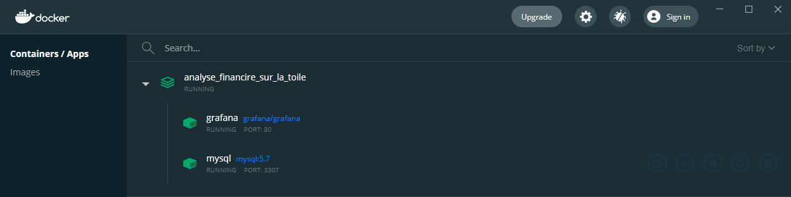
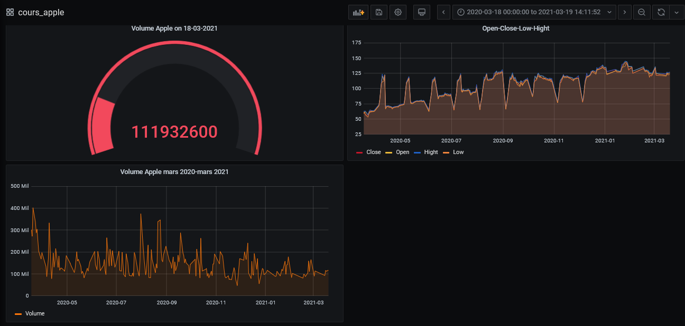

# Analyse-financiere-sur-la-toile

L'objectif est de se servir d'un "robot" (scrapping) qui ira chercher les données pour nous à notre place à chaque fois que l'on s'en servira et à partir de ces données récupéreés on pourra la mettre dans une base de donnée de notre choix afin de faire des graphes à notre guise avec [grafana](https://grafana.com/).
La configuration du robot se fait via le fichier `[apple officiel.ipynb](/apple officiel.ipynb)` 

Toute la construction des conteneurs, la configuration de grafana et l'insertion des données se fait à partir d'un [docker-compose.yml](/docker-compose.yml)

On a choisi de prendre comme source de données [le site sur la bourse d'Apple](https://www.nasdaq.com/market-activity/stocks/aapl/historical/)

Une fois les données récupérées elle sont mises dans un dataset et ensuite exportées au [format csv](/ressources/apple_fini.csv), on a dû utiliser l'instruction `data_fini['Date'] = pd.to_datetime(data_fini['Date'], dayfirst = True)` pour avoir le bon format de date attendu par mysql. Ce fichier csv sera ensuite insérer dans une [base.sql](/ressources/data_cours_apple.sql).

## Installation

On aura besoin du logiciel suivant:
- [Docker desktop pour windows](https://www.docker.com/products/docker-desktop) pour gérer nos diffirénts conteneurs

`##Infos supplémentaires:` Merci de se reférer à mon projet `https://github.com/LuigiBKL/Docker_Grafana` pour savoir à quoi servent les fichiers se trouvant dans [datasources](/datasources),[dashboards](/dashboards)

##A noter que le fichier [geckodriver.exe](/geckodriver.exe) est necessaire au fichier `[apple officiel.ipynb](/apple officiel.ipynb)` pour la configuration de notre "robot" à savoir que chaque configuration est spécifique à un navigateur web

## Manipulations à faire

Ouvrir le cmd se situer dans le dossier ou l'on souhaite travailer à l'aide de la commande 
- cd de l'invite de commande
puis faire:
- `git clone https://github.com/LuigiBKL/Analyse-financi-re-sur-la-toile`
- `docker-compose up -d`
Une fois terminé on a nos conteneurs

On peut donc lancer les serveur de grafana et visualiser nos graphes

